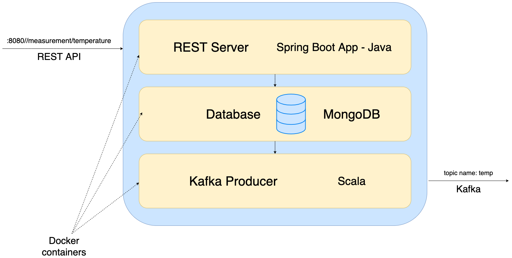

### Schema of server:

## Run instruction
####Server:
#####Prerequisites
``Maven``
``sbt``

#####Commands to run: 
``cd server && ./run.sh``

This command will build both server components: ``kafka-producer`` and ``rest-server``. 
After that it will prepare docker images, compose them and run server with containers ports bound to host.

